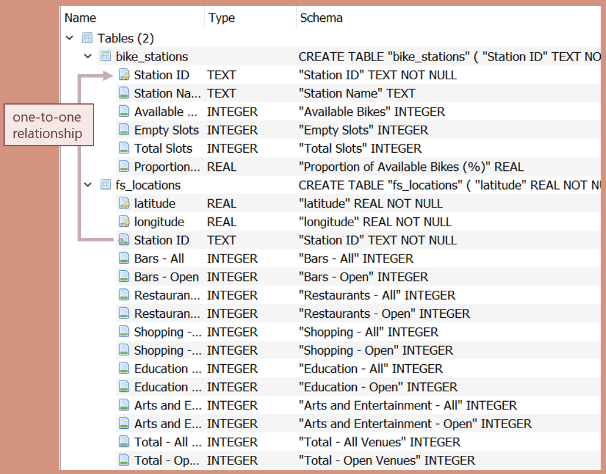
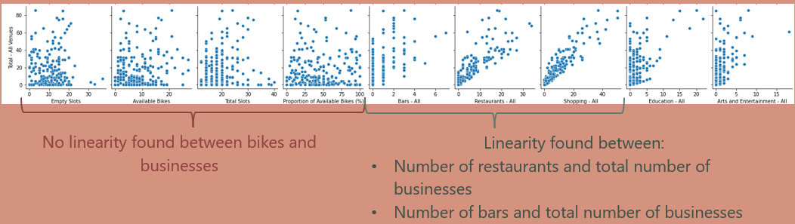
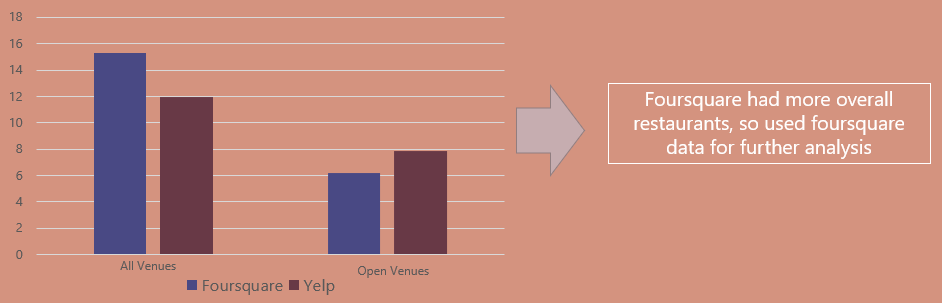
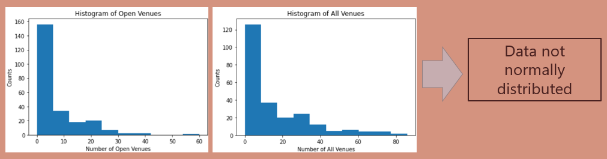
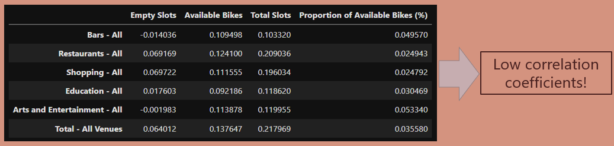
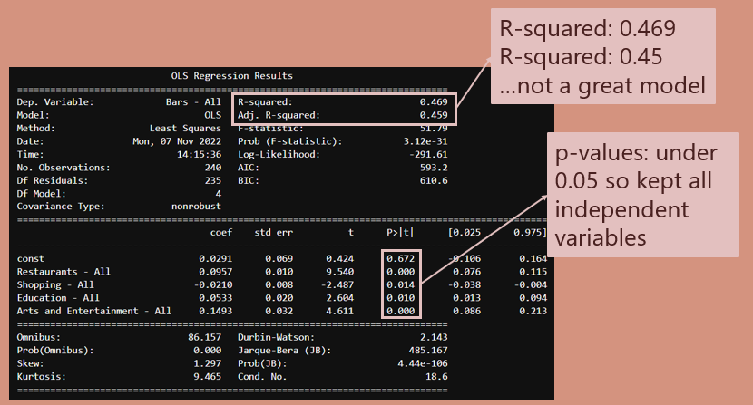

# Final-Project-Statistical-Modelling-with-Python
Note: presentation file is contained in github repo. 

## Project/Goals
Looked at Mobi bikes in Vancouver, BC
Investigated following business types within 100 m of every bike station:

- Bars
- Restaurants
- Shopping
- Education
- Arts and Entertainment

Looked at total numbers of <b>open and closed</b> businesses in each category type

<b>Key Question: Is the number of open businesses correlated with the proportion of available bikes?</b>

 

## Process
### <b>Step 1: City Bike API</b>
1. Parsed JSON file
2. Removed stations with status “offline”, resulting in 240 online bike stations in Vancouver
 
 

### <b>Step 2: Get Data from Foursquare and Yelp APIs</b>
- Used requests.get() function
- For each of the Yelp and Foursquare APIs, created a loop to do the following:
- For each lat/long coordinate:
    - Look at each of the five chosen business types
        - Count all businesses
        - Count open businesses
    - Append results to list
- Reshape list into dataframe and merge dataframe with station ids

 

### <b>Step 3: Joining and Exploring Data</b>
- Combined Foursquare and Citybike data using pd.merge and a left join
    - Joined on the key “Station ID”
 
 
- Explored data using: 
    - histograms
    - correlation coefficients
    - scatter plots
 
 
- Created SQLite database as follows:
    - Bike Stations Table:
        - Used “Station ID” as primary key

    - Foursquare Locations Table:
        - Used “latitude” and “longitude” (combined) as primary key
        - Used “Station ID” as foreign key
    link

### <b>Step 4: Create Model</b>

- Couldn't find correlations between bikes and businesses
    - Therefore decided to look at a model of businesses only and create a regression model to predict the number of bars from the number of other types of businesses
- Dependent variable is number of bars (y)
- Independent variables (x1, x2, x3, x4, x5):
    - number of restaurants
    - number of stores
    - number of arts and entertainment businesses
    - number of education businesses

## <b>Results</b>
### Step 1: City Bike results
- 240 online stations in Vancouver
### Step 2: API Comparison - Foursquare and Yelp

- Foursquare had more overall restaurants, so used foursquare data for further analysis
### Step 3: Joining and EDA Results
Histograms:

Correlation Coefficients:

Scatter Plots:

#### <i>Overall EDA Results</i>
- No correlation between quantity of open businesses and proportion of available bikes
- Low correlation between total slots and number of total businesses
- Low correlation between total slots and number of  restaurants
### Step 4: Model Results

## Challenges 
- Results were not normally distributed or linearly correlated, so could not apply a model to the combined bike and business data 

## Future Goals
- See how open-ness affects availability of bikes by looking at bike availability at different times

- Would look at density of total bikes, not just bikes per station, ideally using a heat map

