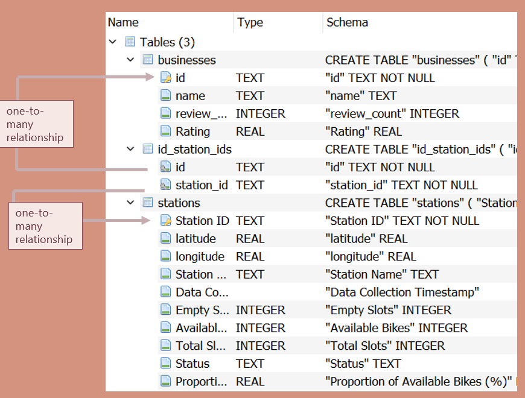
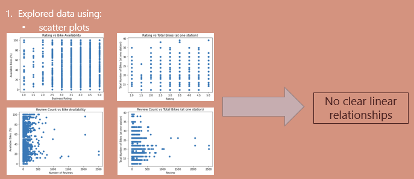
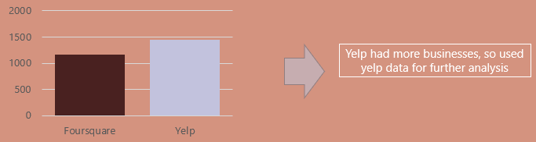
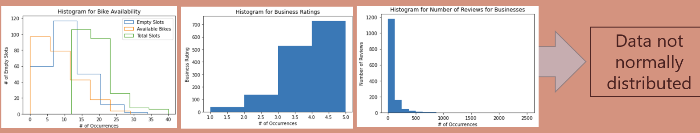
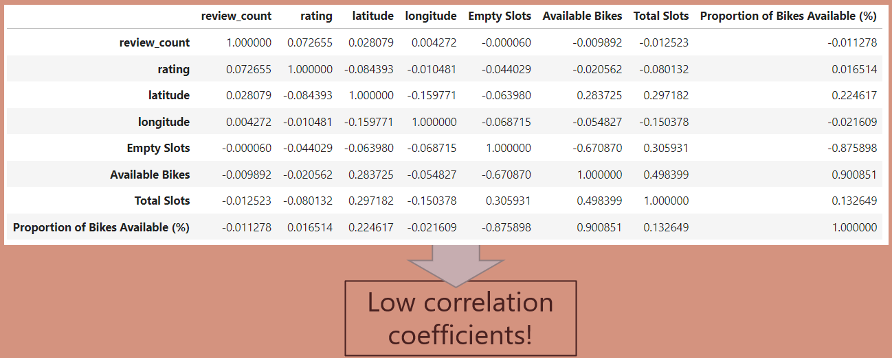
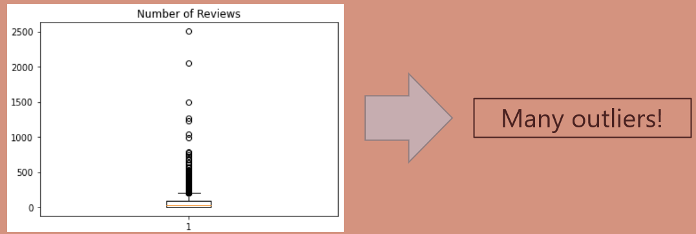
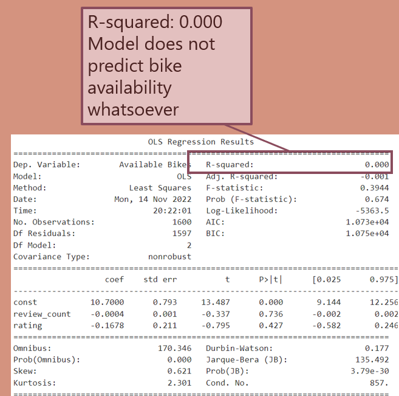
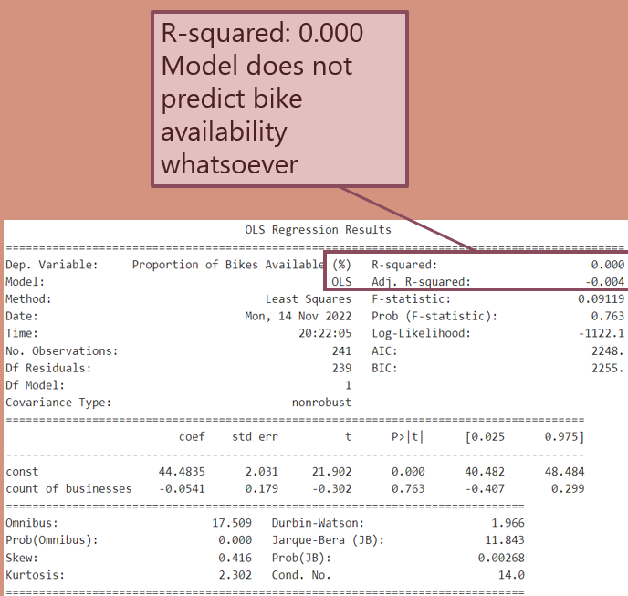

# Final-Project-Statistical-Modelling-with-Python
Note: presentation file is contained in github repo. 

## Project/Goals
Looked at Mobi bikes in Vancouver, BC
Investigated following business types within 100 m of every bike station:

- Bars
- Restaurants

Looked at businesses attributes available from Foursquare and Yelp for bars and restaurants.

<b>Key Questions: </b>
- Are attributes of nearby businesses correlated with proportion of available bikes?
- Is the number of open businesses correlated with the proportion of available bikes?

 

## Process
### <b>Step 1: City Bike API</b>
1. Parsed JSON file
2. Removed stations with status “offline” status.
 
 

### <b>Step 2: Get Data from Foursquare and Yelp APIs</b>

 

### <b>Step 3: Joining and Exploring Data</b>
- Combined Foursquare and Citybike data using pd.merge and a left join
    - Joined on the key “Station ID”
 
 
- Explored data using: 
    - histograms
    - correlation coefficients
    - scatter plots
 
 
- Created SQLite database as follows:
    - Businesses Table:
        - used ‘id’ (automatically assigned by Yelp) as primary key
 
 
    - Bike Stations Table:
        - Used “Station ID” as primary key
         
 

    - Intermediary Table (called ‘id_station_ids’:
        - id and station_id combined as key
        - id was foreign key linked to businesses table 
        - station_id was foreign key linked to stations table

### <b>Step 4: Create Model</b>

- No apparent  correlations between bikes and businesses

Create 2 models: 

- Model 1: number of available bikes as a function count of attributes of nearby restaurants and bars?
    - Dependent variable is Available Proportion of Bikes (%)
    - Independent variables (x1, x2)
        - review_count
        - ratings

- Model 2: number of available bikes as a function of count of nearby restaurants and bars?
    - Dependent variable is Available Proportion of Bikes (%)
    - Independent variables (x1)
        - count of nearby businesses

## <b>Results</b>
### Step 1: City Bike results
- 240 online stations in Vancouver
### Step 2: API Comparison - Foursquare and Yelp

- Yelp had more overall businesses, so used Yelp data for further analysis
### Step 3: Joining and EDA Results
Histograms:

Correlation Coefficients:

Box Plots:

#### <i>Overall EDA Results</i>
- No correlation between quantity of open businesses and proportion of available bikes
- Low correlation between total slots and number of total businesses
- Low correlation between total slots and number of  restaurants
### Step 4: Model Results
<b>Model 1:

Model 2:

</b>

## Challenges 
- Results were not normally distributed
 

## Future Goals
- See how open-ness affects availability of bikes by looking at bike availability at different times

- Would look at density of total bikes, not just bikes per station, ideally using a heat map

